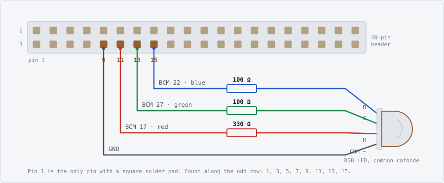
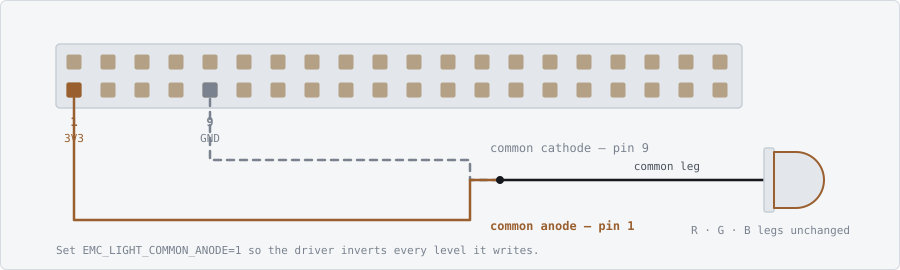

# EdgeMediCheck

Reference implementation of *EdgeMediCheck: An Offline Vision-Based Medicine
Authenticity and Expiry Verification Scanner for Pharmacy Counters*
(Devesh R, Srinikesh D — Sathyabama Institute of Science and Technology).

A pharmacy-counter scanner that combines four checks in one offline workflow:

1. **OCR** — reads batch number, manufacturing date, expiry date and
   manufacturer from the package.
2. **Barcode / GS1** — decodes the 2D code and cross-checks the encoded batch
   and expiry against the printed text.
3. **Local database** — verifies those details against a SQLite batch record
   store seeded from pharmacy stock, invoices and public regulatory alerts.
4. **Visual authentication** — assesses package appearance for print,
   hologram, colour and layout anomalies.

The four streams are fused into a single green / yellow / red verdict with a
short reason code.

> **Scope.** This is a decision-support screening aid. It does not perform
> chemical testing and is not a regulatory or legal authentication authority.

---

## Quick start

```bash
# 1. Install
pip install -r requirements.txt
sudo apt install tesseract-ocr          # macOS: brew install tesseract

# 2. Create the database
python run.py init

# 3. Generate synthetic test images (for pipeline testing only)
python training/make_synthetic_dataset.py --out data/images --count 30

# 4. Seed batch records
python run.py seed --from-manifest data/images/manifest.json

# 5. Scan
python run.py scan data/images/001_genuine_azithral_K24039.jpg

# 6. Or start the pharmacist interface
python run.py serve --backend folder --folder data/images
```

Open <http://127.0.0.1:5000>.

---

## Using it from other devices on the same network

`run.py serve` binds all interfaces by default, so any phone, tablet or PC on
the same Wi-Fi can reach the scanner. On startup it prints the address to use:

```
  EdgeMediCheck
  This device      http://127.0.0.1:5000
  Other devices    http://192.168.1.24:5000
```

Open that second address on the phone. Add `--qr` to print a scannable QR code
of it (`pip install qrcode`).

On a phone or tablet the interface adapts: because the enclosure camera is
attached to the host rather than the handheld device, **Take a photo with this
device** becomes the primary action and opens the rear camera directly. The
photo is uploaded, scanned, and the verdict comes back on the same screen.

```bash
python run.py serve                    # LAN-reachable (default)
python run.py serve --qr               # also print a QR code of the URL
python run.py serve --local-only       # this machine only
python run.py serve --port 8080
```

### If other devices cannot connect

| Symptom | Cause |
|---|---|
| "could not determine this machine's LAN address" | No non-loopback interface. Run `hostname -I` (Linux/Pi) or `ipconfig` (Windows) and use that address manually. |
| Address shown but connection times out | Host firewall. On the Pi: `sudo ufw allow 5000/tcp`. On Windows, allow Python through the private-network firewall. |
| Works on the host, not on the phone | The devices are on different networks — commonly a guest Wi-Fi SSID, or the phone is on mobile data. |
| Address starts with `169.254.` | DHCP was never reached; that address is unroutable. Check the Ethernet/Wi-Fi link. |

The scanner is designed for an offline network, so LAN detection does not
require an internet gateway — it falls back to enumerating local interfaces
when there is no default route.

> **Security.** This interface has no login and runs over plain HTTP. Serve it
> on a trusted pharmacy network only — never on public Wi-Fi or a network
> reachable from the internet. Use `--local-only` to restrict it to the host.
> See *Suggested next features* for the access-control work this implies.

---

## Repository layout

```
edgemedicheck/
├── run.py                        CLI entry point
├── app.py                        Flask pharmacist interface
├── requirements.txt
├── edgemedicheck/
│   ├── config.py                 All tunable thresholds in one place
│   ├── capture.py                Module 1 — Pi Camera / webcam / folder + LED
│   ├── preprocess.py             Algorithm 1 — deskew, denoise, dual streams
│   ├── dateparse.py              Indian label date formats
│   ├── ocr.py                    Algorithm 2 — Tesseract + field extraction
│   ├── barcode.py                GS1 / 2D code decoding + text cross-check
│   ├── splits.py                 Pack-aware and product-aware dataset splits
│   ├── database.py               SQLite batch store + verification
│   ├── cnn.py                    Visual authentication (TFLite / Keras / heuristic)
│   ├── fusion.py                 Algorithm 3 — decision fusion
│   ├── statuslight.py            GPIO RGB verdict light
│   └── pipeline.py               End-to-end orchestration
├── training/
│   ├── make_synthetic_dataset.py Synthetic images for testing
│   └── train_cnn.py              MobileNetV2 transfer learning + TFLite export
├── templates/index.html          Self-contained UI (no external assets)
├── docs/led-wiring.svg           Status light wiring diagram
├── tests/test_pipeline.py        128 tests
└── data/                         Database, images, models (created at runtime)
```

Each module maps to a row of Table IV in the paper.

---

## Commands

| Command | Purpose |
|---|---|
| `run.py init` | Create the SQLite schema |
| `run.py seed --demo` | Insert built-in demo batch records |
| `run.py seed --from-csv f.csv` | Import distributor / stock records |
| `run.py collect` | Guided capture of a labelled dataset |
| `run.py splits` | Inspect and freeze a pack/product-aware split |
| `run.py feedback` | Review or export pharmacist corrections |
| `run.py scan IMAGE` | Scan one image |
| `run.py scan --live` | Capture from the camera and scan |
| `run.py batch FOLDER` | Scan a folder, print a summary table |
| `run.py evaluate MANIFEST` | Score against ground truth (Table VI metrics) |
| `run.py calibrate FOLDER` | Fit the visual check on genuine reference images |
| `run.py products` | List batch records |
| `run.py stats` | Scan-log statistics |
| `run.py light` | Test the GPIO colour status light |
| `run.py serve` | Start the web interface |

---

## The verdict logic

Checks run hard-fail first. Precedence matters: an expired pack is red even if
the packaging looks perfect, because a genuine expired medicine is still unsafe
to dispense.

| Verdict | Meaning | Triggers |
|---|---|---|
| 🔴 **RED** | Do not dispense | **Printed text contradicts the barcode**; expired label, record, or encoded date; recalled / NSQ / spurious batch; label contradicts the record; model-backed counterfeit signal |
| 🟡 **YELLOW** | Verify manually | Unreadable print; batch not in database; borderline appearance; poor capture; near expiry |
| 🟢 **GREEN** | No issue detected | All applicable checks passed |

Two rules are enforced throughout:

**Absence of evidence is never evidence of safety.** An unreadable label or an
unknown batch produces yellow, never green.

**An unknown batch is never red on its own.** The local database is seeded from
pharmacy stock and public alerts, not a national registry, so "not found"
usually means the record is missing — not that the medicine is counterfeit.
Accusing genuine stock destroys trust in the device.

---

## Barcode cross-checking

Reading the 2D code is not simply a more reliable way to get the same fields.
It gives the scanner *two independent renderings of the same facts*:

```
printed text  <->  encoded data
```

Agreement is evidence the label is intact. **Disagreement is direct tamper
evidence** — a relabelled pack whose printed expiry has been altered still
carries the original date inside the code, and neither OCR nor the CNN can see
that on its own. A conflict is therefore ranked above a plain expiry failure.

This does not contradict the paper's position that barcode lookup alone is
insufficient. A copied code on a counterfeit pack still verifies, so the code
by itself proves nothing. Used as a *consistency check against the printed
text*, it catches a class of tampering the other streams miss entirely.

It also measurably improves field accuracy. On the same pack, OCR read the
batch as `RFO159` (an O/0 confusion) and the database returned `UNKNOWN_BATCH`;
with the code decoded the batch read `RF0159` and matched the record. The
scanner prefers the encoded batch for the database lookup for exactly this
reason, and falls back to the OCR value if the encoded one is not on file.

### Decoder support

| Tier | Symbologies | Install |
|---|---|---|
| OpenCV | QR, EAN/UPC/Code128 | built in — nothing to install |
| pyzbar | broader 1D | `pip install pyzbar` + `libzbar0t64` |
| pylibdmtx | **GS1 DataMatrix** | `pip install pylibdmtx` + `libdmtx0t64` |

OpenCV covers QR codes with no extra system libraries, which keeps the
Raspberry Pi install simple. DataMatrix is the symbology most often used on
pharmaceutical cartons, so install `pylibdmtx` where you expect it:

```bash
sudo apt install libdmtx0t64
pip install pylibdmtx
```

> **Package names.** Debian 13 (trixie) and Ubuntu 24.04 onwards renamed
> these libraries for the 64-bit `time_t` transition: `libdmtx0b` became
> `libdmtx0t64` and `libzbar0` became `libzbar0t64`. Raspberry Pi OS built
> on trixie carries the new names, and the old ones resolve to nothing. On
> Debian 12 (bookworm) and earlier, use `libdmtx0b` and `libzbar0`.

> **Latency.** DataMatrix search runs to its full `dmtx_timeout_ms` on every
> preprocessed variant when the pack carries no 2D code, so enabling
> `pylibdmtx` costs roughly `dmtx_timeout_ms x max_variants` per scan in
> that case -- measured at +4.7 s on a Raspberry Pi 4 with the defaults.
> Lower `dmtx_timeout_ms`, or set `EMC_BARCODE=0`, if you are working with
> stock that has no DataMatrix on it.

Disable the stage entirely with `EMC_BARCODE=0` if the latency budget is tight
— DataMatrix search is the slowest step in the pipeline and is bounded by
`BarcodeConfig.dmtx_timeout_ms`.

---

## Collecting a dataset

Collecting the Section V-A dataset is the real blocker between a proposed
system and a results paper, and doing it ad hoc produces images that cannot be
used — inconsistent framing, missing labels, no record of which pack is which.

```bash
python run.py collect --out data/collected --label genuine --shots 8
python run.py collect --out data/collected --label suspicious --shots 8
```

It prompts for product, batch, expiry and manufacturer, captures a burst, and
**rejects unusable frames at capture time** — blurred, badly lit, or package
not filling the frame. Finding that out later means another trip to the
pharmacy.

Each physical carton gets its own auto-incrementing **pack ID**, recorded in
the filename and the manifest:

```
PARACIP__PC24101__p02__05.jpg
   |         |      |    |
product    batch  pack  shot
```

That ID is what makes an honest split possible — see below. Photograph a
*different* carton for each pack number; more shots of the same one belong
under `--shots`.

One pass writes both layouts:

```
data/collected/
├── by_product/PARACIP/...     -> python run.py calibrate data/collected/by_product
├── dataset/genuine/...        -> python training/train_cnn.py --data data/collected/dataset
├── dataset/suspicious/...
└── manifest.json              (labels, pack IDs, per-image quality metrics)
```

---

## Splitting the dataset

**Do not split images at random.** Eight photographs of one carton are not
eight independent samples — they share its creases, scuffs and print run. Put
some in train and some in validation and the network learns to recognise *that
individual carton*. Validation accuracy climbs, real accuracy does not, and
nothing in the training log warns you. This is the most common way a small
vision study reports a number that collapses in deployment.

Two regimes, both enforced in code:

| Regime | Guarantee | Answers |
|---|---|---|
| `pack` | No physical pack spans two folds | Performance on unseen packs of *known* products |
| `product` | Entire products held out of training | Performance on products never seen — the coverage question |

```bash
python run.py splits data/collected/dataset                    # inspect both
python run.py splits data/collected/dataset --regime product --n-holdout 5
python run.py splits data/collected/dataset --out split.json   # freeze it
```

Inspect before training. The output reports **effective sample size in packs,
not images**, and warns when a fold is too small for its metrics to be stable:

```
Split regime: pack  (seed 42)
fold       images   packs  products  by class
--------------------------------------------------------------
train         144      24         8  genuine=84  suspicious=60
val            48       8         4  genuine=30  suspicious=18
test           48       8         5  genuine=30  suspicious=18

Effective sample size: 40 pack(s) across 240 image(s).
Images per pack: 6.0. Statistical power comes from packs, not images.
```

Training runs both regimes by default and prints the comparison:

```bash
python training/train_cnn.py --data data/collected/dataset
```

```
GENERALISATION GAP
  metric         unseen packs   unseen products      drop
  accuracy             0.9412            0.7333    0.2079
  recall               0.9200            0.6400    0.2800
```

**That gap is your most valuable result.** It measures the coverage limitation
instead of asserting it. A large drop is a finding worth reporting, not a
failure to hide.

The script **refuses to train** when a split is too small for the numbers to
mean anything — fewer than ~10 training packs per class, or a single-class
validation fold. Override with `--force`, but do not report what comes out.

Freeze the split alongside any result you publish:

```bash
python run.py splits data/collected/dataset --regime pack --out results/split.json
python training/train_cnn.py --data data/collected/dataset --split-file results/split.json
```

---

## Feedback loop

The result screen has a **"This verdict looks wrong"** control. Every
correction is stored with the captured image, which means the scanner builds
its own training set as a by-product of ordinary use — labelled by a
pharmacist, under real counter conditions, which is precisely the data that is
hardest to collect deliberately.

```bash
python run.py feedback                                  # report
python run.py feedback --export data/feedback_dataset   # as training data
```

The export writes `genuine/` and `suspicious/` folders ready for
`train_cnn.py`, and marks each correction consumed so it is not exported
twice. Expired packs are exported as *genuine* for the visual classifier —
they look fine, and their expiry is caught by OCR and the database, not by
appearance.

The report also shows a disagreement matrix (`yellow->red` and so on), which is
the most direct error analysis available once the device is in service.

> The reported error rate is a **lower bound**, not an estimate. Staff report
> wrong verdicts far more often than they confirm right ones.

---

## Visual authentication

Three backends, selected automatically:

| Backend | When | Can produce RED? |
|---|---|---|
| `tflite` | Trained model present (Raspberry Pi deployment) | Yes |
| `keras` | Trained model present (workstation) | Yes |
| `heuristic` | No trained model — calibrated anomaly score | No, yellow at most |

### Calibrating the heuristic backend

Absolute thresholds do not work for this task: what counts as normal
sharpness, saturation and texture depends entirely on the camera, lens distance
and lighting of a particular enclosure. The heuristic backend therefore
measures raw cues and scores a pack by how far it deviates from reference
images of *known-genuine stock captured in the same enclosure*.

Organise reference images one folder per product:

```
data/reference/
├── PARACIP/     (12+ images of genuine PARACIP packs)
├── AZITHRAL/
└── METFOR/
```

```bash
python run.py calibrate data/reference
```

**Group by product, not in bulk.** Measured on a held-out set, pooling
different package forms into one reference distribution separated genuine from
defective packs at only **AUC 0.66**. Calibrating within a single product form
reached **AUC 0.92–0.99**. A blister strip and a folding carton differ from
each other far more than a genuine carton differs from a defective one, so
pooling them inflates every scale estimate until real defects vanish.

If a scanned product has no reference group, the visual check **abstains**
rather than guessing — the OCR and database checks still apply, and the UI says
so. This is deliberate: scoring an unseen product against other products'
packaging flagged ordinary genuine stock at above 0.94 suspicion.

Refit after any change to lighting, lens distance or hardware.

### Training the CNN

```bash
# Dataset: data/dataset/genuine/*.jpg and data/dataset/suspicious/*.jpg
pip install tensorflow
python training/train_cnn.py --data data/dataset
```

Two-stage transfer learning on MobileNetV2 (frozen head, then fine-tuning),
with class weighting for the imbalance and a TFLite export for the Pi. The
scanner picks up the exported model automatically on next start.

---

## Raspberry Pi deployment

```bash
sudo apt install tesseract-ocr python3-picamera2
pip install -r requirements.txt tflite-runtime RPi.GPIO

# Copy package_authenticity.tflite into data/models/ from your workstation
python run.py serve --backend picamera --host 0.0.0.0
```

Set the LED ring pin in `config.py` (`CaptureConfig.led_gpio_pin`) to drive
illumination from GPIO; leave it `None` and the code runs unchanged without
GPIO hardware.

### Colour status light

The verdict is mirrored onto an RGB LED on the GPIO header. At a counter the
person holding the pack is looking at the pack, not at the screen, so the
result has to be visible from across the counter and readable without reading.

| State | Light |
|---|---|
| Scanning | Pulsing blue |
| 🟢 GREEN | Solid green |
| 🟡 YELLOW | Solid amber |
| 🔴 RED | **Blinking** red |
| Scan failed | Fast magenta blink |
| Pack taken away | Off |

The verdict holds while the pack is in front of the camera and clears when it
is taken away, following the live screen's own idle state. A colour left lit
over an empty counter is a claim about a pack that is not there.

Red blinks and green does not, deliberately. Red/green confusion is the most
common colour vision deficiency, and a device whose whole safety output is a
red-versus-green distinction would be unreadable for roughly one man in twelve.
Motion is the redundant channel: the "stop" state is the only one that moves.

#### Wiring



| LED leg | Pin | Resistor |
|---|---|---|
| Common cathode | GND (header pin 9) | none |
| Red | BCM 17 (header pin 11) | 330 Ω |
| Green | BCM 27 (header pin 13) | 100 Ω |
| Blue | BCM 22 (header pin 15) | 100 Ω |

The resistors differ because the 3.3 V rail does not sit the same distance above
each die. Red drops about 2.0 V and has 1.3 V to spare; green and blue drop
3.0–3.2 V and have almost none. Equal resistors give a bright red beside two
feeble companions — and since amber is a *mix* of red and green, an imbalance
there turns "verify manually" into something that reads as "do not dispense".

Never wire an LED without a resistor: the GPIO pins have no current limiting,
and a direct connection can damage a pin permanently. A ready-made RGB module
(KY-016 and similar) has the resistors on the board already — wire the four pins
straight across.

Leg order on the LED itself varies by manufacturer. The longest leg is always
the common one; `run.py light` tells you whether you guessed the other three
right.

```bash
pip install RPi.GPIO          # or: pip install gpiozero  (required on Pi 5)

export EMC_LIGHT_RED_PIN=17
export EMC_LIGHT_GREEN_PIN=27
export EMC_LIGHT_BLUE_PIN=22

python run.py light           # cycle every state to check the wiring
python run.py light red       # hold one state
```

Three discrete LEDs work identically — the channels are independent. Blue is
optional; without it the "scanning" state falls back to a blinking amber. Red
and green are the minimum, since they carry the verdict.

For a common-anode LED one wire moves: the common leg goes to 3V3 (header pin 1)
instead of GND, and `EMC_LIGHT_COMMON_ANODE=1` inverts every level the driver
writes. Everything else is unchanged.



With no pins set the light is inert and every code path runs unchanged, which
is how the same tree runs on a laptop. A GPIO error at runtime disables the
light and logs once: the LED is an accessory to the verdict, never a reason for
a scan to fail.

### Configuration

Everything tunable lives in `edgemedicheck/config.py`. Environment overrides:

| Variable | Purpose |
|---|---|
| `EMC_DB_PATH` | SQLite database location |
| `EMC_DATA_DIR` | Data root |
| `EMC_CAPTURE_BACKEND` | `auto` / `picamera` / `webcam` / `folder` |
| `EMC_TESSERACT_CMD` | Path to the tesseract binary (Windows) |
| `EMC_HOST`, `EMC_PORT` | Web interface bind address |
| `EMC_LIGHT_RED_PIN`, `_GREEN_PIN`, `_BLUE_PIN` | Status light BCM pins (unset = no light) |
| `EMC_LIGHT_COMMON_ANODE` | `1` for a common-anode LED (inverts every level) |
| `EMC_LIGHT_PWM` | `0` for plain on/off LEDs (no amber mixing, no pulse) |
| `EMC_LIGHT_BRIGHTNESS` | Overall level, `0.0`–`1.0` (PWM only) |
| `EMC_LIGHT_HOLD_SECONDS` | Seconds to hold a verdict; `0` holds until the next scan |
| `EMC_BARCODE` | `0` disables the barcode stage entirely |
| `EMC_DMTX_TIMEOUT_MS` | DataMatrix search budget per variant (default 1500) |
| `EMC_BARCODE_MAX_VARIANTS` | Preprocessed variants to try before giving up (default 3) |

A pack with no 2D code costs `EMC_DMTX_TIMEOUT_MS x EMC_BARCODE_MAX_VARIANTS`
before the search gives up, so on a Raspberry Pi the default 1500 ms turns a
6.7 s scan into a 13.2 s one. Lower it where the stock you handle does not
carry DataMatrix.

---

## Evaluation

```bash
python run.py evaluate data/testset/manifest.json --out report.json
```

Reports the Table VI metrics: OCR field accuracy, date parsing accuracy,
database-match correctness, end-to-end verdict correctness, a confusion matrix,
and latency.

Example run on 20 synthetic images:

```
OCR field extraction
  batch  read  17/20  correct  17  precision 100.0%  recall  85.0%
  expiry read  18/20  correct  18  precision 100.0%  recall  90.0%

End-to-end verdict
  correct 19/20  ( 95.0%)

Confusion (ground truth -> verdict)
  truth           green   yellow      red
  expired             0        0        5
  genuine             9        1        0
  suspicious          0        5        0

Latency  mean 758 ms  min 593  max 1292
```

> **These numbers are from synthetic images and must not be reported as
> results.** They measure the pipeline against a renderer, not against real
> packaging. Collect the real dataset described in Section V-A of the paper
> before reporting accuracy. Latency measured on a workstation will also be
> several times faster than on Raspberry Pi 4 hardware.

---

## Tests

```bash
python tests/test_pipeline.py
```

128 tests covering date parsing across Indian label formats, GS1 element-string
parsing, barcode/text cross-checking, database verification precedence,
decision fusion, preprocessing, calibration scoping, dataset splitting, schema
migration, the GPIO status light, and LAN address detection.

Several are regression tests for bugs found during development:

- **Date-pattern precedence** — a label window containing two dates assigned
  the expiry as the manufacturing date.
- **Calibration/scan preprocessing mismatch** — reference cues were measured on
  full frames while scans measured cropped packages, which made the visual
  check worse than chance.
- **Manufacturer OCR bleed** — a merged warning line produced a hard mismatch
  and a RED verdict on a genuine pack.
- **Schema migration** — an upgraded scanner must not lose its audit history.

---

## Known limitations

- **No chemical testing.** Packaging inspection cannot detect a correct-looking
  pack containing the wrong substance.
- **Database completeness.** A genuine batch absent from the local store reads
  as unknown.
- **Product coverage.** The CNN and the calibrated heuristic only generalise to
  products represented in their training or reference data.
- **OCR on damaged print.** Worn, curved or low-contrast batch codes on foil
  strips remain the main source of unreadable fields.

## License and attribution

Academic project code from Sathyabama Institute of Science and Technology.
Built with OpenCV, Tesseract OCR, TensorFlow Lite, SQLite and Flask.
